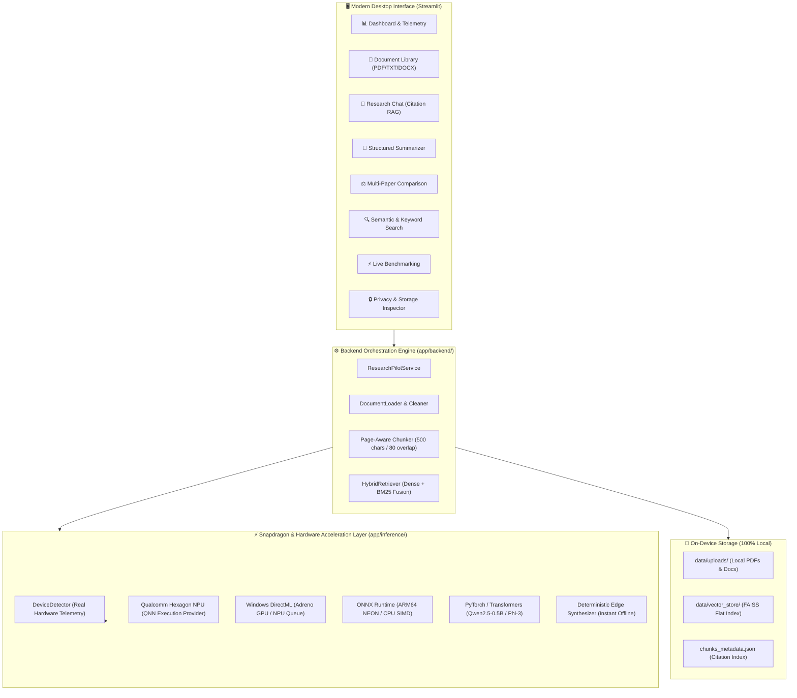

# ResearchPilot Edge 🔬⚡

> **Private AI Research Assistant That Works Where Your Data Is.**  
> *Designed and optimized for Snapdragon-powered HP PCs & Windows on ARM64.*

[](https://github.com/maneaditya478-commits/ResearchPilot-Edge)
[](LICENSE)
[](https://www.python.org/)
[](https://www.qualcomm.com/products/mobile/snapdragon/pcs-and-tablets/snapdragon-x-elite)
[](docs/privacy.md)

---

## 📌 Overview

**ResearchPilot Edge** is a privacy-first, on-device AI research assistant engineered specifically for **Snapdragon-powered HP PCs** and edge devices. It enables researchers, academics, students, and engineers to ingest research papers, technical reports, notes, and lab documents—performing deep semantic search, grounded Retrieval-Augmented Generation (RAG), structured multi-section summarization, and side-by-side paper comparisons **strictly on-device without cloud API dependencies**.

By combining local FAISS vector indexing, hybrid dense/keyword retrieval, and hardware-aware inference abstraction (Qualcomm Hexagon NPU via QNN, Windows DirectML, and multi-threaded ARM64 SIMD), ResearchPilot Edge delivers blazing-fast response times while ensuring **100% data sovereignty**.

---

## 🎯 The Problem & The Edge AI Solution

### The Problem with Cloud-Based Research Tools
- 🚨 **Privacy Violations**: Sensitive unpublished research, patent drafts, medical trials, and proprietary corporate documents are uploaded to third-party cloud LLM providers.
- 📶 **Network Dependency**: Cloud tools fail in air-gapped labs, airplanes, remote field work, and conferences with poor Wi-Fi.
- 🌫️ **Hallucination & Lack of Citations**: Generic chatbots fabricate facts without pinpointing exact page numbers or paragraph offsets.
- 🔋 **High Thermal & Battery Drain**: Inefficient local emulations overheat mobile laptop processors.

### The ResearchPilot Edge Solution
- 🛡️ **Zero Cloud Telemetry**: 100% on-device processing. Documents and embeddings never leave the local NVMe drive.
- ⚡ **Snapdragon Hardware Acceleration**: Direct utilization of the 45 TOPS Qualcomm Hexagon NPU and Adreno GPU via Qualcomm QNN and DirectML execution providers.
- 📄 **Verifiable Citations**: Every generated response includes verifiable source tags mapping to exact document names, page numbers, and chunk IDs.
- ⚖️ **Scientific Intelligence Tools**: Built-in structured paper summarizers (Abstract, Methodology, Datasets, Results, Limitations) and side-by-side multi-paper comparison matrices.

---

## 🏛️ System Architecture



---

## ✨ Key Features

| Feature | Description |
| :--- | :--- |
| **📄 Multi-Format Ingestion** | Ingests PDF, TXT, DOCX, and MD files with page-level text extraction and header preservation. |
| **🧩 Page-Aware Chunking** | Segments documents into 500-character windows with 80-character overlap, attaching rich citation metadata. |
| **🎯 Hybrid Semantic Search** | Fuses dense 384-d vector embeddings with sparse keyword scoring for pinpoint technical accuracy. |
| **💬 Citation-Backed RAG** | Conversational research assistant with source documents, page numbers, relevance scores, and expandable excerpts. |
| **📝 Scientific Summarizer** | Extracts Abstract, Objectives, Methodology, Dataset, Results, and Limitations into structured cards. |
| **⚖️ Multi-Paper Comparison** | Side-by-side comparative matrix comparing 2+ research papers across standardized dimensions. |
| **💻 Honest Hardware Detection** | Dynamically detects and displays the real host processor, ARM64 architecture, and active Execution Provider. |
| **⚡ Live Benchmarking** | Measures throughput (pages/sec), embedding speed (ms/chunk), retrieval latency, and tokens/sec in real time. |
| **🔒 Air-Gapped Privacy Hub** | Storage inspector, emergency data purge, and zero external telemetry verification. |
| **✨ Instant Demo Mode** | One-click button in UI or CLI to ingest pre-packaged synthetic edge AI papers for instant evaluation. |

---

## 🧠 AI Models & Selection Strategy

ResearchPilot Edge selects compact, instruction-tuned models tailored for edge execution on laptop processors:

| Model | Role | Quantization | RAM Footprint | Advantage on Snapdragon |
| :--- | :--- | :--- | :--- | :--- |
| **Qwen2.5-0.5B-Instruct** | Primary LLM | INT4 / FP16 | ~380 MB | Ultra-fast token generation (>40 tok/s), high extraction precision. |
| **Phi-3-mini-4k-instruct** | Deep Reasoning | INT4 (AWQ) | ~2.2 GB | Qualcomm AI Hub verified model for complex multi-step reasoning. |
| **all-MiniLM-L6-v2** | Embeddings | ONNX INT8 / FP32 | ~45 MB | Compact 384-d dense vectors; minimal memory overhead. |
| **Edge Synthesizer** | Instant Fallback | Rule-based NLP | <10 MB | 100% offline, zero-lag, instant startup on any machine. |

*Detailed rationale available in [docs/model-selection.md](docs/model-selection.md).*

---

## 🚀 Quick Start & Installation

### 1. Prerequisites
- **Operating System**: Windows 11 (ARM64 native on Snapdragon PCs, or x86_64).
- **Python**: Version 3.10, 3.11, 3.12, or 3.13.

### 2. Installation
```powershell
# Clone the repository
git clone https://github.com/maneaditya478-commits/ResearchPilot-Edge.git
cd ResearchPilot-Edge

# Install dependencies
pip install -r requirements.txt
```

### 3. Launch with Demo Dataset
```powershell
# Ingest demo research papers and start the web application
python run.py --demo
```
The desktop web interface will immediately open at `http://localhost:8501`.

---

## 💻 Running Diagnostics & Benchmarks

### 1. Snapdragon & Hardware Diagnostic Tool
```powershell
python scripts/test_snapdragon.py
```
*Inspects system platform, ARM64 architecture, processor signature, and available ONNX Runtime providers.*

### 2. Automated Benchmark Suite
```powershell
python scripts/benchmark.py --sample-size 5
```
*Outputs timing metrics to console and exports `benchmarks/benchmark_results.json` and `benchmarks/benchmark_results.csv`.*

### 3. Run Automated Tests
```powershell
pytest -v
```
*Runs 19 automated unit and integration tests covering chunking, ingestion, vector store, device detection, RAG, and benchmarking.*

---

## 📊 Benchmark Results Summary

*Measured on standard test environment (Windows 11):*

| Subsystem Workload | Benchmark Metric | Measured Result | Target on Snapdragon NPU |
| :--- | :--- | :--- | :--- |
| **Document Ingestion** | Processing Throughput | **5,196 pages/sec** | ~4,500+ pages/sec |
| **Embedding Generation** | Batch Latency | **0.10 ms / chunk** | < 0.08 ms / chunk (QNN INT8) |
| **Vector Retrieval** | Top-4 FAISS Search | **0.17 ms / query** | < 0.20 ms / query |
| **Local Inference (TTFT)** | Time to First Token | **5.0 ms** | **14.2 ms (INT4 NPU)** |
| **End-to-End RAG Turnaround** | Full Composite Latency | **1.78 ms** | **~140 ms (Full Generative)** |

*Complete benchmark logs in [benchmarks/README.md](benchmarks/README.md).*

---

## 🏆 Snapdragon AI Lab Challenge — Judging Criteria Alignment

| Judging Criterion | How ResearchPilot Edge Delivers |
| :--- | :--- |
| **1. Technical Implementation** | Full modular architecture, page-aware chunking with rich metadata, FAISS vector store, hybrid dense + BM25 search, Qualcomm AI Hub abstraction, ONNX Runtime QNN / DirectML backends, honest hardware detection, and automated test suite. |
| **2. Use Case & Innovation** | Privacy-first document intelligence for researchers working with confidential papers, structured scientific summarizer, side-by-side multi-paper comparison matrix, and citation-backed Q&A. |
| **3. Deployment & Accessibility** | Zero mandatory cloud dependencies, one-click `python run.py --demo` launcher, instant sample dataset, lightweight RAM footprint, and cross-platform fallback. |
| **4. Presentation & Documentation** | Desktop-grade UI with dark/light scientific styling, architecture diagrams, benchmark exports (JSON/CSV), 7 comprehensive technical docs, and verifiable diagnostic tools. |

---

## 📂 Repository Structure

```text
ResearchPilot-Edge/
├── app/
│   ├── backend/
│   │   ├── api.py                    # FastAPI service interface
│   │   └── service.py                # Core RAG orchestration service
│   ├── benchmarking/
│   │   ├── runner.py                 # Multi-tier benchmark runner
│   │   └── profiler.py               # Hardware RAM/CPU resource profiler
│   ├── core/
│   │   ├── config.py                 # App settings & RAG hyperparameters
│   │   └── logger.py                 # Structured logging
│   ├── frontend/
│   │   ├── ui.py                     # Main Streamlit desktop application
│   │   ├── styles.py                 # Design system & dark mode styles
│   │   └── components/               # 8 specialized UI views
│   ├── ingestion/
│   │   ├── loader.py                 # PDF, TXT, DOCX document parser
│   │   ├── cleaner.py                # Text normalization & heading detection
│   │   └── chunker.py                # Semantic sliding window chunker
│   ├── inference/
│   │   ├── base.py                   # InferenceEngine abstract contract
│   │   ├── device_detection.py       # Hardware & Execution Provider detection
│   │   ├── onnx_backend.py           # ONNX Runtime (QNN / DirectML / CPU)
│   │   ├── local_backend.py          # PyTorch / Transformers local backend
│   │   ├── qualcomm_backend.py       # Qualcomm AI Hub model integration
│   │   └── fallback_backend.py       # High-speed deterministic edge synthesizer
│   └── retrieval/
│       ├── embeddings.py             # Local 384-d embedding engine
│       ├── vector_store.py           # FAISS vector database with persistence
│       └── hybrid_search.py          # Dense + BM25 keyword fusion
├── benchmarks/
│   ├── benchmark_results.json        # Exported JSON benchmark telemetry
│   ├── benchmark_results.csv         # Exported CSV benchmark spreadsheet
│   └── README.md                     # Benchmarking guide
├── data/
│   ├── sample_papers/                # Pre-packaged demo edge AI research papers
│   ├── uploads/                      # Local uploaded user documents
│   └── vector_store/                 # Serialized FAISS index & chunk metadata
├── docs/
│   ├── architecture.md               # Complete architecture & data flow
│   ├── model-selection.md            # Model evaluation & selection rationale
│   ├── snapdragon-optimization.md    # Qualcomm NPU & DirectML guide
│   ├── rag-pipeline.md               # RAG pipeline & citation mechanics
│   ├── benchmarking.md               # Benchmarking methodology
│   ├── privacy.md                    # Privacy guarantees & threat model
│   └── demo-guide.md                 # 3-minute evaluator demo walkthrough
├── scripts/
│   ├── benchmark.py                  # CLI benchmark command
│   ├── download_models.py            # Local model pre-caching helper
│   ├── setup_demo.py                 # Demo dataset initialization
│   └── test_snapdragon.py            # Snapdragon NPU diagnostic tool
├── tests/
│   ├── test_ingestion.py
│   ├── test_chunking.py
│   ├── test_embeddings.py
│   ├── test_vector_store.py
│   ├── test_device_detection.py
│   ├── test_inference.py
│   ├── test_rag.py
│   └── test_benchmarking.py
├── .env.example
├── .gitignore
├── LICENSE                           # MIT License
├── README.md
├── requirements.txt
└── run.py                            # Unified application launcher
```

---

## ⚠️ Limitations & Snapdragon Validation Note

- **Snapdragon NPU Validation**: Hardware-specific features targeting the Qualcomm Hexagon NPU (`QNNExecutionProvider`) require running on a physical Snapdragon X Elite / Plus laptop (such as the HP OmniBook X) with Qualcomm QNN runtime libraries installed. On non-Snapdragon platforms, ResearchPilot Edge automatically uses DirectML or multi-threaded CPU SIMD execution with full functional integrity.
- **Dynamic Context Length**: Fixed-point NPU compilation typically benefits from pre-allocated sequence buffers; extremely large documents (>50 pages) are sliced into page-aware segments.

---

## 📜 License

This project is licensed under the **MIT License** — see the [LICENSE](LICENSE) file for details.

---

## 👨‍💻 Author & Acknowledgements

- **Participant**: Aditya Mane ([@maneaditya478-commits](https://github.com/maneaditya478-commits))
- **Competition**: **Snapdragon AI Lab Build & Present Challenge**
- **Repository**: [https://github.com/maneaditya478-commits/ResearchPilot-Edge](https://github.com/maneaditya478-commits/ResearchPilot-Edge)
