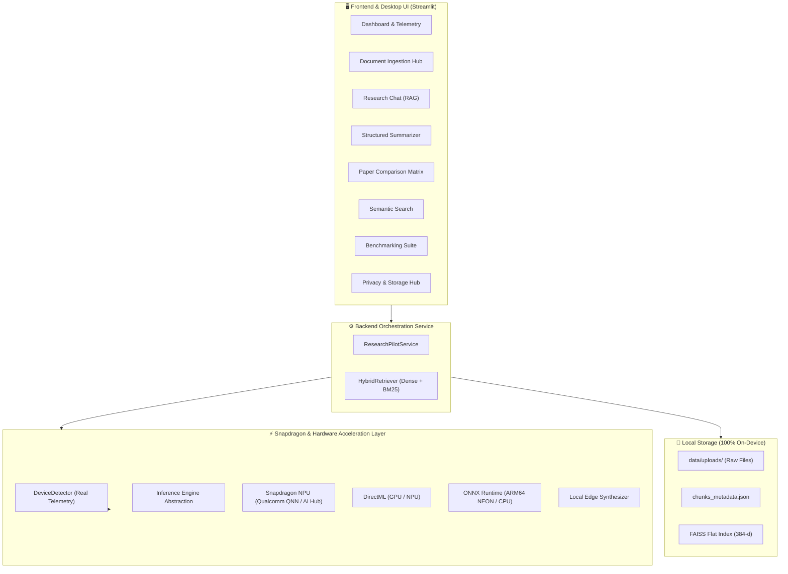

# Architecture Documentation — ResearchPilot Edge

## 1. System Overview

ResearchPilot Edge is an on-device, privacy-first AI research assistant designed and optimized for Snapdragon-powered HP PCs (Windows on ARM64) and edge platforms. It brings deep document intelligence, grounded Retrieval-Augmented Generation (RAG), and multi-paper comparative analysis directly to the user's laptop without transmitting confidential documents to remote cloud APIs.



---

## 2. Layered Component Architecture

### 2.1 Ingestion & Chunking Layer (`app/ingestion/`)
- **DocumentLoader**: Parses PDF (via `pypdf`), TXT, and DOCX (via `python-docx`) files page-by-page.
- **DocumentCleaner**: Normalizes whitespace, repairs broken hyphenation across line breaks, and preserves markdown headers.
- **DocumentChunker**: Slices documents into sliding windows (500 characters, 80 character overlap) while tagging every chunk with rich citation metadata (`document`, `page`, `chunk_id`, `section`, `char_count`).

### 2.2 Retrieval & Storage Layer (`app/retrieval/`)
- **EmbeddingEngine**: Employs `all-MiniLM-L6-v2` (ONNX / local PyTorch) and a fast deterministic fallback vectorizer yielding normalized 384-dimensional dense vectors.
- **VectorStore**: FAISS `IndexFlatIP` performing exact cosine similarity search over normalized vectors with persistent disk serialization (`faiss_index.bin` and `chunks_metadata.json`).
- **HybridRetriever**: Combines dense vector similarity scores with term-frequency keyword matching to ensure pinpoint precision on technical terms, acronyms, and model names.

### 2.3 Hardware & Inference Abstraction Layer (`app/inference/`)
- **DeviceDetector**: Real-time system inspection checking ARM64 architecture, Qualcomm Snapdragon SoC signatures, and ONNX Runtime Execution Providers (`QNNExecutionProvider`, `DmlExecutionProvider`, `CPUExecutionProvider`).
- **InferenceEngine (Base Interface)**: Defines the standard contract for `generate()`, `summarize()`, and `compare()`.
- **Implementations**:
  - `QualcommAIHubInferenceEngine`: Qualcomm AI Hub model compilation and QNN execution workflow.
  - `ONNXInferenceEngine`: Hardware-accelerated ONNX Runtime execution.
  - `LocalTransformersInferenceEngine`: PyTorch / HuggingFace local models (`Qwen2.5-0.5B-Instruct`, `Phi-3-mini`).
  - `DeterministicLocalInferenceEngine`: High-speed local extractive & rule-based engine guaranteeing 100% offline uptime and zero-lag judging demos.

### 2.4 Application Service Layer (`app/backend/`)
- **ResearchPilotService**: Central singleton providing high-level APIs for file ingestion, citation-aware RAG queries, structured summarization, multi-paper comparison, and telemetry tracking.

---

## 3. Data Flow

```text
User PDF Upload
    ↓
DocumentLoader (Page Extraction)
    ↓
DocumentCleaner (Whitespace & Heading Normalization)
    ↓
DocumentChunker (500-char Window + Metadata Tagging)
    ↓
EmbeddingEngine (384-d L2 Normalized Vector)
    ↓
FAISS Vector Store (Disk & RAM Indexing)
    ↓
User Query → HybridRetriever (Dense Similarity + BM25 Fusion)
    ↓
Context Assembly (Top-K Chunks + Source Labels)
    ↓
Snapdragon / ONNX / Local Inference Engine
    ↓
Grounded Answer + Page-Numbered Source Citations
```
