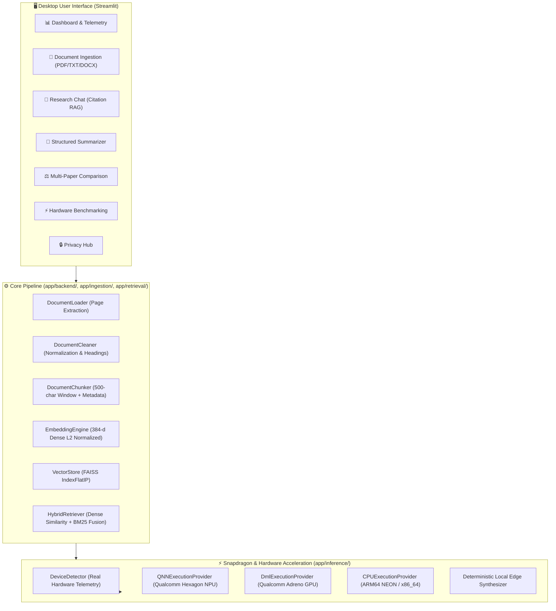

# System Architecture — ResearchPilot Edge

## 1. High-Level Modular Architecture

```text
                           ResearchPilot Edge
                                    │
        ┌───────────────────────────┼───────────────────────────┐
        │                           │                           │
    Documents                    Research                   Hardware
    Ingestion                    RAG                        Detection
    Chunking                     Retrieval                  QNN / DirectML
    Embeddings                   Local LLM                  CPU SIMD
    FAISS Storage                Answer + Sources           Live Metrics
        │                           │                           │
        └───────────────────────────┼───────────────────────────┘
                                    │
                            Private Local AI
```

---

## 2. Component Pipeline & Data Flow



---

## 3. Detailed Component Breakdown

### 3.1 Document Ingestion & Page-Aware Chunking (`app/ingestion/`)
- **`DocumentLoader`**: Extracts text page-by-page from PDF (via `pypdf`), TXT, and DOCX (`python-docx`).
- **`DocumentCleaner`**: Removes spurious whitespace, fixes broken hyphenations across line breaks, and preserves markdown headers.
- **`DocumentChunker`**: Generates 500-character semantic chunks with 80-character overlap, attaching rich citation metadata: `{"document": str, "page": int, "chunk_id": str, "section": str, "text": str}`.

### 3.2 Local Retrieval & Vector Storage (`app/retrieval/`)
- **`EmbeddingEngine`**: Generates 384-dimensional dense vectors using local models and deterministic edge vectorizers.
- **`VectorStore`**: Employs FAISS `IndexFlatIP` on normalized vectors for exact cosine similarity with disk persistence (`faiss_index.bin` & `chunks_metadata.json`).
- **`HybridRetriever`**: Fuses dense vector similarity with sparse BM25 term-frequency scores for precision on technical terms.

### 3.3 Hardware Acceleration & Inference (`app/inference/`)
- **`DeviceDetector`**: Real-time system inspection testing OS, ARM64 architecture, processor signature, and probing ONNX execution providers.
- **`QualcommAIHubInferenceEngine`**: Abstraction for Qualcomm AI Hub model integration and QNN compilation.
- **`ONNXInferenceEngine`**: Hardware-accelerated execution with provider priority: `QNNExecutionProvider` $\rightarrow$ `DmlExecutionProvider` $\rightarrow$ `CPUExecutionProvider`.
- **`DeterministicLocalInferenceEngine`**: Ultra-fast offline extractive NLP engine guaranteeing 100% offline uptime and anti-hallucination answers.
