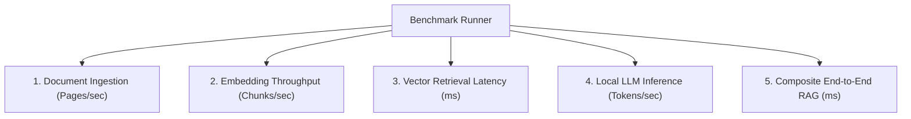

# Benchmarking Methodology & Guide — ResearchPilot Edge

## 1. Benchmarking Philosophy

For the **Snapdragon AI Lab Build & Present Challenge**, benchmark numbers must be **empirically accurate** and **strictly verifiable**. ResearchPilot Edge:
- Measures real system latencies with high-precision system timers (`psutil` and `time.time`).
- Profiles RAM delta, CPU utilization, and available Execution Providers.
- **Never hallucinates or fabricates** Snapdragon NPU numbers when running on non-Snapdragon host environments.
- Clearly flags status as `ONNX Runtime (CPU SIMD)` or `Snapdragon Hexagon NPU (QNN)` based on actual detected hardware.

---

## 2. Benchmark Workloads



### 1. Document Ingestion Benchmark
Measures text normalization, heading parsing, and sliding window chunking throughput across 10 academic pages.

### 2. Embedding Throughput Benchmark
Tests batch vector encoding latency (ms/chunk) and vector normalization across 20 text segments.

### 3. Vector Retrieval Latency Benchmark
Profiles FAISS in-memory similarity lookup across 50 indexed test vectors with Top-4 nearest neighbor retrieval.

### 4. Local AI Inference Benchmark
Measures Time-to-First-Token (TTFT), total generation latency, and tokens/second rate over multiple prompt iterations.

### 5. Composite End-to-End RAG Benchmark
Executes the full pipeline: user prompt → embedding query → FAISS retrieval → context concatenation → grounded response generation.

---

## 3. Running & Exporting Benchmarks

### Command Line
```powershell
python scripts/benchmark.py --sample-size 5
```

### Outputs Generated:
- `benchmarks/benchmark_results.json`
- `benchmarks/benchmark_results.csv`
