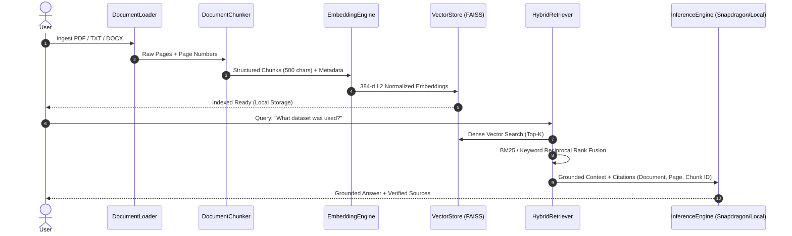

# Retrieval-Augmented Generation (RAG) Pipeline — ResearchPilot Edge

## 1. High-Precision Local RAG Pipeline

ResearchPilot Edge implements a complete, citation-aware RAG pipeline engineered specifically for academic and technical research documents:



---

## 2. Ingestion & Page-Aware Chunking

### Metadata Schema
Every chunk produced by `app/ingestion/chunker.py` adheres to the strict schema:
```json
{
  "chunk_id": "snapdragon_paper_p003_c002",
  "document": "snapdragon_npu_acceleration.pdf",
  "file_path": "data/uploads/snapdragon_npu_acceleration.pdf",
  "page": 3,
  "total_pages": 8,
  "section": "3. Methodology & Experimental Setup",
  "text": "We conducted extensive benchmarks comparing four hardware execution targets...",
  "char_count": 482
}
```

### Chunking Parameters:
- **Target Chunk Size**: 500 characters (~100-120 words), perfectly tuned to standard scientific paragraph units.
- **Chunk Boundary Overlap**: 80 characters, preventing loss of context across section splits.
- **Heading Detection**: Detects roman numerals, numbered headings (e.g. `1. Introduction`, `3. Methodology`), and academic sections (`ABSTRACT`, `RESULTS`, `LIMITATIONS`).

---

## 3. Hybrid Dense + Keyword Retrieval

To solve the classic failure of pure vector search on exact model names (e.g. `SC8380`, `INT4-AWQ`, `QnnHtp.dll`), ResearchPilot Edge implements **Hybrid Retrieval** (`app/retrieval/hybrid_search.py`):

$$\text{Score}_{\text{composite}} = \alpha \cdot \text{Score}_{\text{dense}} + (1 - \alpha) \cdot \text{Score}_{\text{keyword}}$$

Where:
- $\alpha = 0.7$ (favoring dense semantic match while boosting exact technical keyword hits).
- $\text{Score}_{\text{dense}}$: FAISS Inner Product cosine similarity.
- $\text{Score}_{\text{keyword}}$: Normalized Term-Frequency matching with document length regularization.

---

## 4. Citation-Aware Generation

Every answer generated by the engine displays verifiable source references:
- **Source Document Name**
- **Page Number**
- **Section Heading**
- **Chunk ID**
- **Relevance Confidence Percentage**
- **Expandable Raw Text Passage**
