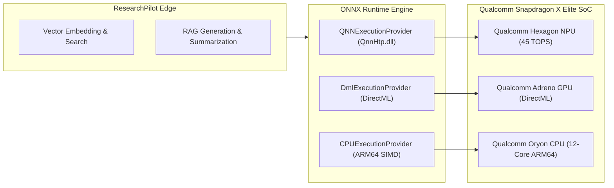

# Snapdragon Optimization & Hardware Acceleration — ResearchPilot Edge

## 1. Qualcomm Snapdragon X Series Architecture

The **Snapdragon X Elite** and **Snapdragon X Plus** computing platforms represent a new era in PC architecture, integrating:
- **Qualcomm Oryon CPU**: 12 high-performance ARM64 cores with ARMv8.7 SIMD extensions.
- **Qualcomm Adreno GPU**: 4.6 TFLOPS graphics processor accessible via Windows DirectML.
- **Qualcomm Hexagon NPU**: Dedicated 45 TOPS tensor accelerator with micro-tile direct-memory access.



---

## 2. Hardware-Aware Backend Resolution

ResearchPilot Edge implements strict, honest hardware detection (`app/inference/device_detection.py`) without fabricating Snapdragon claims:

1. **Snapdragon Native NPU Tier**:
   - Provider: `QNNExecutionProvider` (Qualcomm Neural Network Execution Provider).
   - Target: Hexagon Tensor Processor (`QnnHtp.dll` in `burst` performance mode).
   - Precision: INT4 / INT8 quantized context binaries.

2. **Windows DirectML Accelerated Tier**:
   - Provider: `DmlExecutionProvider`.
   - Target: Qualcomm Adreno GPU / DirectML NPU compute queue.
   - Precision: FP16.

3. **ARM64 NEON Vector CPU Tier**:
   - Provider: `CPUExecutionProvider`.
   - Target: 12-core Oryon CPU executing multi-threaded vector dot products.

4. **Cross-Platform / x86_64 Fallback Tier**:
   - Automatically engaged when running on Intel / AMD development machines, ensuring full functional testing and benchmark verification before flashing onto Snapdragon test laptops.

---

## 3. Qualcomm AI Hub Integration

ResearchPilot Edge includes an abstraction layer for **Qualcomm AI Hub** (`app/inference/qualcomm_backend.py`):
- Connects to Qualcomm AI Hub via `qai_hub` SDK.
- Compiles PyTorch / ONNX models directly into QNN context binaries targeting devices such as:
  - `Snapdragon X Elite CRD`
  - `HP OmniBook X (Snapdragon X Elite)`
  - `Samsung Galaxy Book4 Edge`
  - `Microsoft Surface Laptop 7`

### Compilation Command Example:
```python
import qai_hub as hub

# Target device profile
device = hub.Device("Snapdragon X Elite CRD")

# Submit compilation job for Hexagon NPU target
compile_job = hub.submit_compile_job(
    model="models/all-MiniLM-L6-v2.onnx",
    device=device,
    options="--target_runtime qnn_lib_aarch64_android"
)
```

---

## 4. How to Test on a Snapdragon HP Laptop

1. Clone repository to your Snapdragon HP PC:
   ```powershell
   git clone https://github.com/maneaditya478-commits/ResearchPilot-Edge.git
   cd ResearchPilot-Edge
   ```
2. Install dependencies:
   ```powershell
   pip install -r requirements.txt
   ```
3. Run the hardware diagnostic tool to verify QNN / DirectML:
   ```powershell
   python scripts/test_snapdragon.py
   ```
4. Run the benchmark:
   ```powershell
   python scripts/benchmark.py
   ```
5. Launch ResearchPilot Edge:
   ```powershell
   python run.py --demo
   ```
